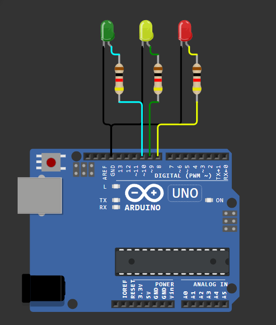

# 🚦 Traffic Light Simulation


## 📌 Deskripsi
Simulasi lampu lalu lintas sederhana menggunakan 3 LED (Merah, Kuning, Hijau) yang menyala secara berurutan dengan interval 1 detik.

<div align="center">
  
</div>

## 🛠️ Komponen yang Dibutuhkan
- Arduino Uno x1
- LED Merah x1
- LED Kuning x1  
- LED Hijau x1
- Resistor 220Ω x3
- Breadboard x1
- Kabel Jumper secukupnya

## 📋 Wiring Diagram

| Komponen | Arduino Pin | Keterangan |
|----------|-------------|------------|
| LED Merah (+) | Pin 8 | Melalui resistor 220Ω |
| LED Kuning (+) | Pin 9 | Melalui resistor 220Ω |
| LED Hijau (+) | Pin 10 | Melalui resistor 220Ω |
| LED (-) | GND | Semua LED ke ground |

## 💻 Cara Kerja
1. **Inisialisasi**: Semua LED dimatikan pada awal program
2. **Loop Utama**:
   - LED Merah menyala selama 1 detik
   - LED Kuning menyala selama 1 detik
   - LED Hijau menyala selama 1 detik
   - Kembali ke LED Merah (loop tak terbatas)
3. **Serial Monitor**: Menampilkan status LED yang sedang menyala

## 🔧 Instalasi
1. Buka Arduino IDE
2. Copy kode dari file `lights.ino`
3. Pilih board "Arduino Uno"
4. Pilih port yang sesuai
5. Upload kode ke Arduino
6. Buka Serial Monitor untuk melihat status

## 🎯 Konsep yang Dipelajari
- **Digital Output**: Menggunakan `digitalWrite()` untuk mengontrol LED
- **Delay**: Mengatur timing dengan `delay()`
- **Serial Communication**: Output ke Serial Monitor
- **Pin Configuration**: Setup pin sebagai OUTPUT
- **Function**: Membuat fungsi untuk modularitas kode

## 🔬 Simulasi Online
🔌 Coba Simulasi di Wokwi]([https://wokwi.com/](https://wokwi.com/projects/418127986005632001)

## 🚀 Pengembangan Lanjutan
- Tambahkan tombol untuk mengontrol lampu manual
- Buat timer yang berbeda untuk setiap LED
- Tambahkan buzzer untuk suara
- Implementasikan sensor untuk deteksi kendaraan

---
⬅️ [Kembali ke Menu Utama](../README.md) | ➡️ [Proyek Selanjutnya](../02-proximity-sensor/)
  digitalWrite(ledk, LOW);
  digitalWrite(ledh, HIGH);
  Serial.println("Hijau menyala");
  delay(1000); // tunggu 1 detik
}
```

### Cara Kerja Program

Secara keseluruhan, program ini:

1. Menyalakan LED merah selama 1 detik → tampilkan "Merah menyala" di serial monitor
2. Menyalakan LED kuning selama 1 detik → tampilkan "Kuning menyala"
3. Menyalakan LED hijau selama 1 detik → tampilkan "Hijau menyala"
4. Ulangi terus-menerus

### Coba Demo Proyek Ini 

[🔌 Klik untuk Simulasi di Wokwi](https://wokwi.com/projects/418127986005632001)
