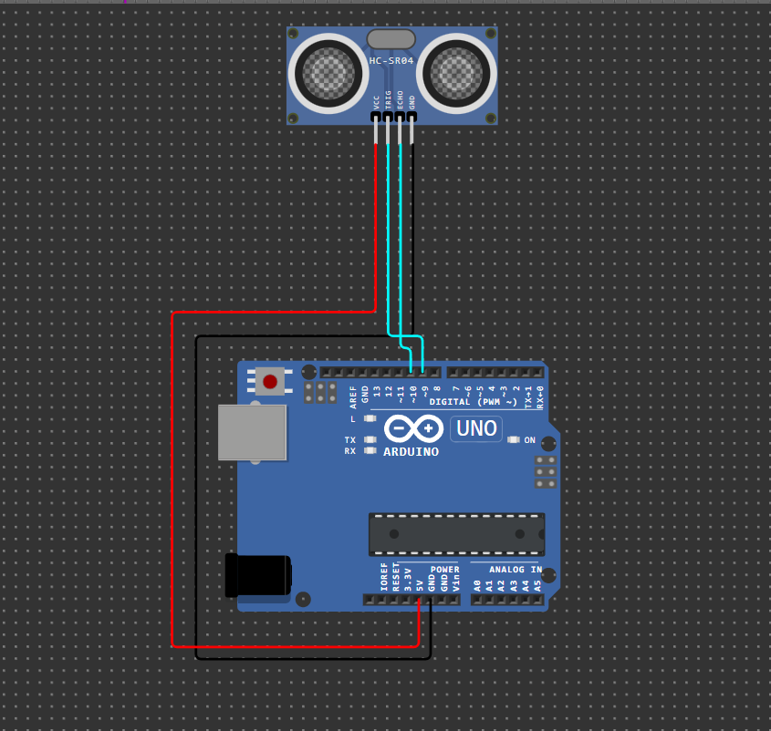

# 📡 Ultrasonic Distance Sensor (HC-SR04)


## 📌 Deskripsi
Proyek pengukuran jarak menggunakan sensor ultrasonik HC-SR04 dengan Arduino Uno. Sensor dapat mengukur jarak objek dari 2cm hingga 400cm dengan akurasi tinggi.

<div align="center">
  
</div>

## 🛠️ Komponen yang Dibutuhkan
- Arduino Uno x1
- Sensor Ultrasonik HC-SR04 x1
- Kabel Jumper Male-Male x4
- Breadboard x1 (opsional)

## 📋 Wiring Diagram

| HC-SR04 Pin | Arduino Pin | Fungsi |
|-------------|-------------|---------|
| VCC | 5V | Power supply (5V) |
| GND | GND | Ground |
| Trig | Pin 9 | Trigger pulse output |
| Echo | Pin 10 | Echo pulse input |

## 🔬 Cara Kerja Sensor
1. **Trigger**: Arduino mengirim sinyal 10µs ke pin Trig
2. **Ultrasonic Pulse**: Sensor memancarkan gelombang ultrasonik (40kHz)
3. **Echo**: Gelombang memantul dari objek kembali ke sensor
4. **Timing**: Sensor mengukur waktu perjalanan gelombang
5. **Calculation**: Jarak = (waktu × kecepatan suara) ÷ 2

### Formula Perhitungan
```
Jarak (cm) = (Duration × 0.034) ÷ 2
```
- **0.034**: Kecepatan suara (343 m/s = 0.034 cm/µs)
- **÷ 2**: Karena gelombang pergi-pulang

## 💻 Fitur Program
- ✅ Pengukuran jarak real-time
- ✅ Validasi range pengukuran (2-400 cm)
- ✅ Timeout handling untuk error
- ✅ Indikator proximity (Sangat dekat, Dekat, Sedang, Jauh)
- ✅ Serial monitor output dengan format yang rapi
- ✅ Error handling untuk pengukuran yang gagal

## 🔧 Instalasi & Penggunaan
1. **Wiring**: Hubungkan sensor sesuai diagram di atas
2. **Upload Code**: Upload `sensor.ino` ke Arduino
3. **Serial Monitor**: Buka Serial Monitor (9600 baud)
4. **Testing**: Letakkan objek di depan sensor dan lihat hasil

### Output Serial Monitor
```
=== Ultrasonic Distance Sensor ===
Initializing sensor...
Sensor ready! Starting measurements...
Distance readings (cm):
------------------------
Distance: 15.2 cm - Close 🟡
Distance: 8.7 cm - VERY CLOSE! 🔴
Distance: 45.3 cm - Moderate 🟢
Distance: OUT OF RANGE or ERROR
```

## 🎯 Aplikasi Praktis
- **Sistem Parkir**: Deteksi jarak kendaraan
- **Robot Obstacle Avoidance**: Hindari rintangan
- **Liquid Level Monitoring**: Monitor ketinggian cairan
- **Automatic Door**: Pintu otomatis
- **Security System**: Deteksi pergerakan
- **Distance Measurement Tool**: Penggaris digital

## 🚀 Pengembangan Lanjutan
- Tambahkan LCD untuk display jarak
- Integrasikan buzzer untuk alarm proximity
- Buat data logger dengan SD card
- Tambahkan multiple sensor untuk sudut berbeda
- Implementasikan filter untuk smoothing data

## 🔗 Simulasi Online
[🔌 Coba Simulasi di Wokwi](https://wokwi.com/projects/418680848311396353)

## 🐛 Troubleshooting
- **No Reading**: Periksa koneksi VCC dan GND
- **Erratic Reading**: Pastikan wiring tidak longgar
- **Out of Range**: Objek terlalu dekat (<2cm) atau jauh (>400cm)
- **No Serial Output**: Periksa baud rate Serial Monitor (9600)

---
⬅️ [Proyek Sebelumnya](../01-turn-on-light/) | [Menu Utama](../README.md) | ➡️ [Proyek Selanjutnya](../03-buzzer-sound/)
