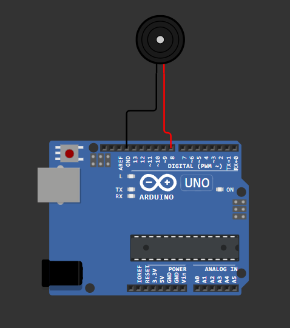

<h1 align="center">Buzzer & Fix You by Coldplay</h1>

###

<p align="left">Proyek arduino uno dengan buzzer yang memaunkan melodi potongan lagu Fix You.</p>

###

<h3 align="left">Komponen Proyek</h3>

- Arduino Uno 
- Buzzer 
- Kabel Jumper

###

<h3 align="left">Penjelasan Kode</h3>

```
int melody[] = {329, 392, 440, 392, 329, 329, 392, 440, 392, 329}; 
```

Array yang digunakan untuk menyimpan frekeunsi nada yang dimainkan dalam bentuk Hertz(Hz)

```
int duration[] = {500, 500, 500, 500, 1000, 500, 500, 500, 500, 1000};
```

Array yang digunakan untuk menyimpan jarak antar nada ketika di mainkan 

- 500 = 0.5 detik 
- 1000 = 1 detik

```
for (int i = 0; i < 10; i++) {
  tone(buzzerPin, melody[i], duration[i]);
  delay(duration[i] + 100);
}
delay(2000);
```

#### Looping 

1. Melakukan perulangan sebanyak 10 nada.
2. Di setiap perulangan:

- tone(buzzerPin, frequency, duration) memerintahkan buzzer mengeluarkan nada tertentu selama durasi yang ditentukan.
- delay(duration + 100) memberikan jeda antara nada, agar terdengar terpisah.

3. Setelah semua nada dimainkan, menunggu 2 detik sebelum mengulang melodi lagi.

### Demo Proyek 

[🔌 Klik untuk Simulasi di Wokwi](https://wokwi.com/projects/418174569374700545)
