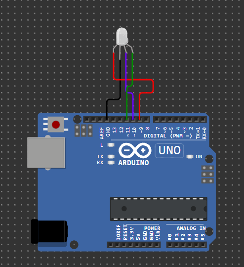

<h1 align="center">RGB Light</h1>

<p>Pada proyek ini, saya membuat proyek sederhana yaitu menyalakan lampu RGB yang dapat berkedap-kedip.</p>


<h3 align="center">Penjelasan</h3>

```
int red = 9;   // Pin digital 9 untuk LED merah
int green = 10; // Pin digital 10 untuk LED hijau  
int blue = 11;  // Pin digital 11 untuk LED biru
```
Bagian ini mendefinisikan pin mana yang terhubung ke setiap warna LED RGB.

### Fungsi `setup()` 

```
void setup() {
  pinMode(red, OUTPUT);
  pinMode(green, OUTPUT);
  pinMode(blue, OUTPUT);
}
```
Fungsi ini dijalankan sekali saat Arduino pertama kali dinyalakan. Di sini, ketiga pin (9, 10, 11) diatur sebagai OUTPUT, artinya pin-pin tersebut akan mengirim sinyal keluar untuk mengontrol LED.

### Fungsi `loop()`

```
void loop() {
  // Nyalakan LED merah
  analogWrite(red, 225);
  analogWrite(green, 0);
  analogWrite(blue, 0);
  delay(100);
  
  // Nyalakan LED hijau
  analogWrite(red, 0);
  analogWrite(green, 225);
  analogWrite(blue, 0);
  delay(100);
  
  // Nyalakan LED biru
  analogWrite(red, 0);
  analogWrite(green, 0);
  analogWrite(blue, 225);
  delay(100);
}
```

Fungsi ini berjalan berulang-ulang selamanya. Program ini menciptakan efek berkedip berurutan:

1. Fase 1: LED merah menyala dengan kecerahan 225 (dari skala 0-255), LED hijau dan biru mati (0)
2. Delay 100ms: Jeda sebentar
3. Fase 2: LED hijau menyala dengan kecerahan 225, LED merah dan biru mati
4. Delay 100ms: Jeda sebentar
5. Fase 3: LED biru menyala dengan kecerahan 225, LED merah dan hijau mati
6. Delay 100ms: Jeda sebentar
7. Kembali ke fase 1 dan berulang

### Hasil akhir 

LED RGB akan berkedip berurutan: Merah → Hijau → Biru → Merah → Hijau → Biru, dan seterusnya, dengan interval 100 milisedetik antar pergantian warna. Efeknya seperti lampu disco sederhana yang berganti warna secara berurutan.

### Demo proyek 
[🔌 Klik untuk Simulasi di Wokwi](https://wokwi.com/projects/418174084092608513)

