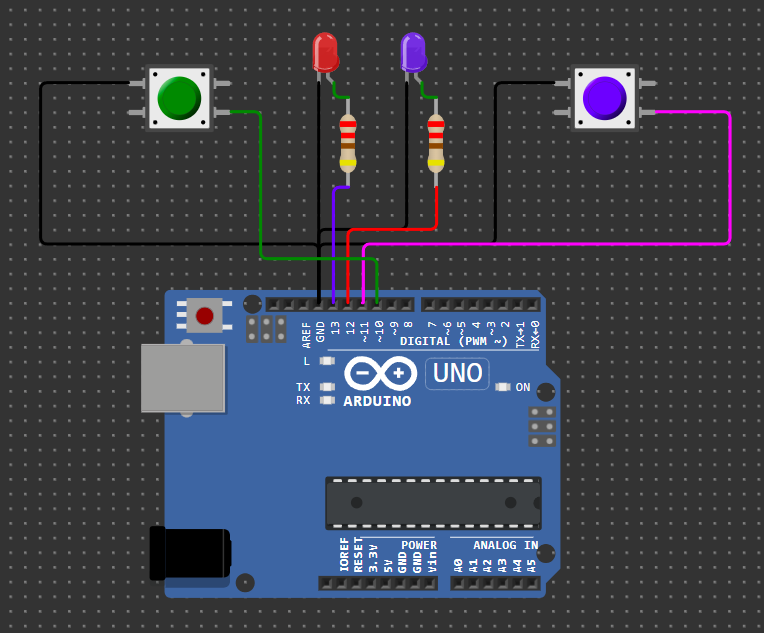

<h1 align="center">LED Button</h1>

Membuat rangkaian Arduino Uno dengan 2 tombol dan 2 LED yang bekerja sesuai tombol masing-masing.

### Komponen yang Digunakan

1. Arduino Uno
2. 2 Push Button
3. 2 LED (Merah dan Ungu)
4. 2 Resistor (sekitar 220Ω)
5. Kabel jumper

### Wiring Komponen

| Komponen     | Pin Arduino | Fungsi                      |
| ------------ | ----------- | --------------------------- |
| LED Merah    | Pin 13      | LED atas                    |
| LED Ungu     | Pin 12      | LED bawah                   |
| Tombol Hijau | Pin 10      | Mengontrol LED merah (atas) |
| Tombol Ungu  | Pin 11      | Mengontrol LED ungu (bawah) |

### Kesimpulan bekerja

- Tombol ungu (pin 11) → menyalakan LED ungu (pin 12)
- Tombol hijau (pin 10) → menyalakan LED merah (pin 13)
- LED hanya menyala selama tombol ditekan

### Demo proyek 
[🔌 Klik untuk Simulasi di Wokwi](https://wokwi.com/projects/418148007991444481)
