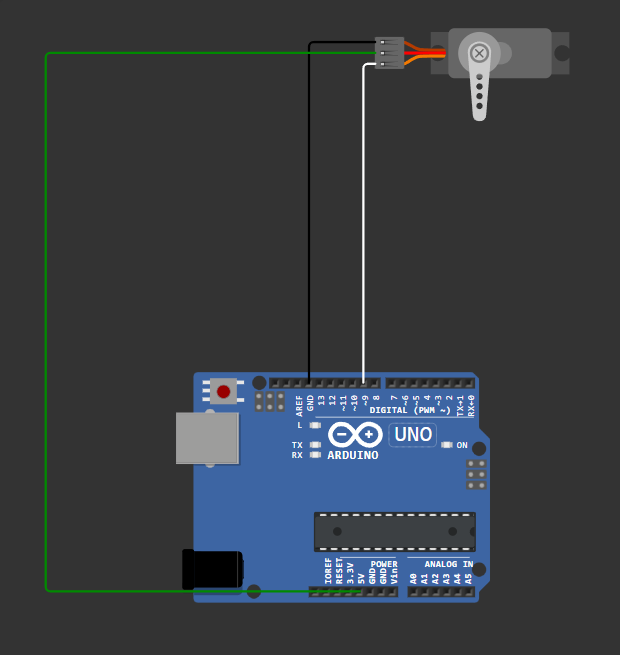

<h1 align="center">Servo</h1>

 Servo motor yang dikendalikan oleh Arduino Uno melalui pin 9, dan servo bergerak dari 0° ke 90°, lalu ke 180°, secara berurutan.




### Komponen 

- 1x Arduino Uno
- 1x Servo Motor
- Beberapa kabel jumper


### Wiring dan Rangkaian 
#### Koneksi dari servo ke Arduino:

| Kabel Servo  | Fungsi       | Terhubung ke Arduino |
| ------------ | ------------ | -------------------- |
| Merah        | VCC (+5V)    | 5V                   |
| Coklat/Hitam | GND (Ground) | GND                  |
| Oranye       | Sinyal       | Pin 9                |

### Penjelasan Kode 

```
#include <Servo.h>
```
Mengimpor library Servo.h agar kita bisa menggunakan fungsi attach() dan write() untuk kontrol servo.

```
Servo myservo1;

void setup() {
  myservo1.attach(9); // Hubungkan objek servo ke pin digital 9
}
```

`myservo1.attach(9)` artinya servo akan dikendalikan dari pin digital 9.

### Apa yang akan terjadi dan bagaimana urutannya

1. Servo akan bergerak dari posisi 0°, ke 90°, lalu ke 180°.
2. Setiap pergerakan akan berhenti selama 1 detik (1000 ms).
3. Setelah mencapai 180°, kode kembali ke awal (loop), dan servo mengulang gerakan dari 0°

```
0° → tunggu → 90° → tunggu → 180° → ulang lagi...
```


### Demo proyek 
[🔌 Klik untuk Simulasi di Wokwi](https://wokwi.com/projects/437100600901493761)